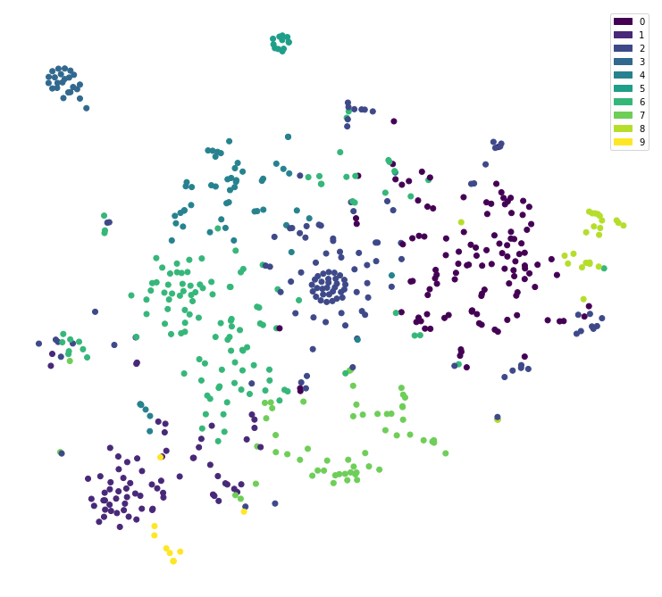
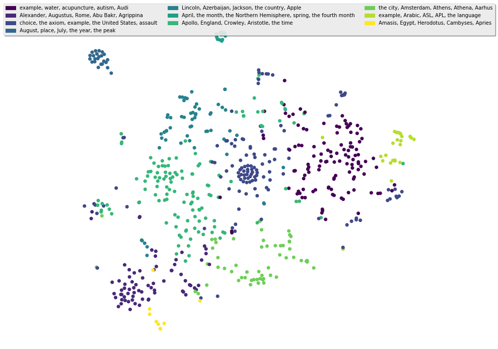

# Document Clustering

This notebook runs K-Means clustering on my data.

### Table of Contents
- [Loading Data](#loading-data)
- [Vectorizing](#tf-idf-vectors) is where I fix X, Y and Z
- [K-Means](#k-means) is where I convert A to B
- [t-SNE visualization](#t-sne) rounds up with some observations
- [Results](#results)

Note: `reformat.py` contains some important code used to preprocess the outputted wiki dump from the [wikiextractor](wikiextractor).

This notebook will open a few sample JSON files and attempt to cluster them and label the clusters.


```python
import json
import glob
```

### Loading Data


```python
wiki_articles = []
for x in glob.glob('data/wiki*.json'):
    new_articles = json.load(open(x))['articles']
    wiki_articles += new_articles
wiki_articles[0].keys()
```

dict_keys(['id', 'text', 'url', 'title'])


```python
for article in wiki_articles[:5]:
    for key, val in article.items():
        if key != 'text':
            print(key, ':', val)
```

    id : 894
    url : https://en.wikipedia.org/wiki?curid=894
    title : Agnosticism
    id : 896
    url : https://en.wikipedia.org/wiki?curid=896
    title : Argon
    id : 897
    url : https://en.wikipedia.org/wiki?curid=897
    title : Arsenic
    id : 898
    url : https://en.wikipedia.org/wiki?curid=898
    title : Antimony
    id : 899
    url : https://en.wikipedia.org/wiki?curid=899
    title : Actinium


Looks like my JSON conversions worked! The only problem now, is finding links that are actually related to one another so I can effectively test my clustering algorithm. I don't have my data pre-organized by topics...

We'll wee what we can visualize with T-SNE first.

### Tf-idf Vectors


```python
from sklearn.feature_extraction.text import TfidfVectorizer
tfidf = TfidfVectorizer(max_df=0.8, max_features=20000,
                                 min_df=0.2, stop_words='english',
                                 use_idf=True, ngram_range=(1,3))
wiki_articles_text = [x['text'] for x in wiki_articles]
wiki_articles_titles = [x['title'] for x in wiki_articles]
tfidf_vectors = tfidf.fit_transform(wiki_articles_text)
```

### K-Means


```python
from sklearn.metrics import jaccard_similarity_score
from sklearn.metrics.pairwise import cosine_similarity
dist = 1 - cosine_similarity(tfidf_vectors)

```


```python
from sklearn.cluster import KMeans
num_clusters = 10

km = KMeans(n_clusters=num_clusters)

%time km.fit(tfidf_vectors)

clusters = km.labels_.tolist()
```

    CPU times: user 3.54 s, sys: 4 ms, total: 3.54 s
    Wall time: 3.54 s


```python
from sklearn.externals import joblib
joblib.dump(km,  'clusters/doc_cluster{}.pkl'.format(num_clusters))

km = joblib.load('clusters/doc_cluster{}.pkl'.format(num_clusters))
clusters = km.labels_.tolist()
```

### t-SNE

Cluster visualization using [t-distributed stochastic neighbor embedding (t-SNE)](https://lvdmaaten.github.io/tsne/)


```python
from sklearn.manifold import TSNE
from sklearn.decomposition import TruncatedSVD
import matplotlib.pyplot as plt
import matplotlib.patches as mpatches
X_reduced = TruncatedSVD(n_components=50, random_state=0).fit_transform(tfidf_vectors)
X_embedded = TSNE(n_components=2, perplexity=40, verbose=0).fit_transform(X_reduced)
fig = plt.figure(figsize=(10, 10))
ax = plt.axes(frameon=False)
plt.setp(ax, xticks=(), yticks=())
plt.subplots_adjust(left=0.0, bottom=0.0, right=1.0, top=0.9,
                wspace=0.0, hspace=0.0)

plt.scatter(X_embedded[:, 0], X_embedded[:, 1],
            c=clusters, marker="o")
#plt.colorbar()
cmap = plt.cm.get_cmap('viridis', num_clusters)
plt.legend([mpatches.Patch(color=cmap(b)) for b in range(num_clusters)],
           [str(x) for x in range(num_clusters)])
plt.show()
```





### Results


```python
cluster_titles = dict()
for cluster, title in zip(clusters, wiki_articles_titles):
    if cluster not in cluster_titles:
        cluster_titles[cluster] = []
    cluster_titles[cluster].append(title)
```


```python
for cluster, titles in cluster_titles.items():
    print(cluster, ':' , ', '.join(titles), '\n')
```

    0 : Argon, Arsenic, Antimony, Actinium, Americium, Astatine, Atom, Aluminium, Anxiety, Axiom, Alpha, Axon, Acute disseminated encephalomyelitis, Ataxia, Alcohol, Auto racing, Autism, Albedo, A, Altruism, Anthropology, Agricultural science, Astronomer, ASCII, Animation, Arithmetic mean, Amphibian, Aquaculture, Aloe, Amaryllis, Ambergris, Anaximenes of Miletus, Abscess, Algorithms for calculating variance, Almond, Amplitude modulation, Ardipithecus, Assembly line, Accordion, Artificial intelligence, Architect, Anaconda, Audi, Aircraft, Motor neuron disease, MessagePad, Abalone, Aromatic hydrocarbon, Antimatter, Antiparticle, Apple I, Apatosaurus, Allosaurus, AK-47, Anchor, Ammonia, Amethyst, Albertosaurus, Ambrosia, Amber, Alphorn, Alder, Arachnophobia, Alabaster, Algol, Anno Domini, Amine, Absolute zero, Adiabatic process, Amide, Acacia sensu lato, Apollo program, Agate, Aspirin, Acupuncture, Amaranth, Agriculture, Algae, Analysis of variance, Alkane, Assistive technology, Abacus, Acid, Asphalt, Astronaut, Alkali metal, Anatomy, Aardvark, Aardwolf, Adobe, Astrometry, Alloy, Angle, Acoustics, Atomic physics, Applet, Atomic orbital, Amino acid, Astronomical unit, Acoustic theory, Advanced Encryption Standard, Anisotropy, Alpha decay, Analytical Engine, Transport in Antarctica, Android (robot), Actinopterygii, Amateur astronomy, Aikido, Abortion, Annual plant, Mouthwash, Asteroids (video game), Asparagales, Asteroid, Aries (constellation), Aquarius (constellation), Anime

    1 : Azincourt, Achilles, Alexander I of Scotland, Alexander II of Scotland, Alexander I of Serbia, Alexander III of Scotland, Severus Alexander, Alexander Jannaeus, Alexios I Komnenos, Alexios III Angelos, Alexei Petrovich, Tsarevich of Russia, Alfred the Great, Alyattes of Lydia, Amalasuntha, Afonso I of Portugal, Afonso II of Portugal, Afonso III of Portugal, Afonso IV of Portugal, Afonso V of Portugal, Afonso VI of Portugal, Alphonso I of Spain, Alfonso II of Asturias, Alfonso XII of Spain, Alfonso XIII of Spain, Alfonso the Battler, Alfonso III of Aragon, Alfonso IV of Aragon, Alfonso V of Aragon, Abu Bakr, Ambrosius Aurelianus, Ammon, Amyntas I of Macedon, Amyntas III of Macedon, Ancus Marcius, Andrew II of Hungary, Attila, Alp Arslan, Amalaric, Ahab, Alcuin, Angilbert, Abraham, Absalom, Albert Alcibiades, Margrave of Brandenburg-Kulmbach, Albert the Bear, Albert of Brandenburg, Albert, Duke of Prussia, Abner, Ahmed I, Aeneas, Agamemnon, Agesilaus II, Agnes of Merania, Agrippina the Elder, Agrippina the Younger, Ahmad Shah Durrani, Ajax the Lesser, Alaric II, Alboin, Afonso de Albuquerque, Alcmene, Ealdred (archbishop of York), Alexander I of Epirus, Alexander Balas, Alexander of Pherae, Alexander Jagiellon, Alexander III of Russia, Ashoka, Arianism, Antoninus Pius, Augustus, Alexander the Great

    2 : Arable land, Advanced Chemistry, Anglican Communion, Arne Kaijser, Asociación Alumni, AM, Asteraceae, Apiaceae, American shot, Applied ethics, Absolute value, Analog signal, Arecales, Algebraically closed field, Aspect ratio, Academy Award for Best Production Design, International Atomic Time, Alain Connes, Alien, Austin (disambiguation), American Football Conference, Alexander of Greece (disambiguation), Alexander, Alexander I, Alexander III, Alexander IV, Alexander V, Alexandrists, Hymn to Proserpine, The Triumph of Time, Alger of Liège, Age of consent, Alphons, Alfonso I, Amati, Alfonso III, Alfonso IV, Alfonso V, Alfonso VI, Autpert Ambrose, Ancyra (genus), Anastasius I, Anastasius, Andrea Andreani, Abatement, Amateur, All Souls' Day, Royal Antigua and Barbuda Defence Force, Demographics of Armenia, Geography of American Samoa, Demographics of American Samoa, Politics of American Samoa, America's National Game, Atlantic (disambiguation), Algebraic number, Automorphism, APL, Axiom of choice, Aztlan Underground, Analog Brothers, Altenberg, Abbess, Abdominal surgery, Abduction, Almost all, Arabian Prince, Associative property, Apache Software Foundation, Ancylopoda, Alligatoridae, ASIC (disambiguation), Dasyproctidae, AV, Abbotsford House, Abydos, Assault, Álfheimr, NYSE MKT, Dodo (Alice's Adventures in Wonderland), Lory (disambiguation), Albert, Albert I, Albert III, Adder, Agapanthus africanus, Agasias, Agis, Antonio Agliardi, American Chinese cuisine, Ahenobarbus, Arthur Aikin, Ailanthus, Ajax, Alcamenes, Ada, Appellate procedure in the United States, Answer (law), Appellate court, Arraignment, Argument (disambiguation), Atomic number, Affirming the consequent, Animal (disambiguation), Asia Minor (disambiguation), Antisymmetric relation, Amber Diceless Roleplaying Game, Athene (disambiguation), Atomic, Asa, Area, American (word), List of anthropologists, Algorithms (journal), Agnostida, Abstract (law), Ampere, Anthophyta, Atlas (disambiguation), Alismatales, Apiales, Asterales, Allocution, Affidavit, Asterism

    3 : August, August 22, August 27, August 6, August 23, August 24, August 31, August 9, August 13, August 2, August 7, August 8, August 14, August 15, August 16, August 17, August 12, August 18, August 19, August 21, August 25, August 1, August 3

    4 : Antigua and Barbuda, Anarchism, Alabama, Abraham Lincoln, Algeria, Andorra, Andrew Jackson, Andrew Johnson, Andaman Islands, Anarcho-capitalism, Demographics of Antigua and Barbuda, Politics of Antigua and Barbuda, Telecommunications in Antigua and Barbuda, Antisemitism, Economy of Azerbaijan, Foreign relations of Azerbaijan, Azerbaijani Armed Forces, Politics of Armenia, Economy of Armenia, Transport in Armenia, Armed Forces of Armenia, Foreign relations of Armenia, Economy of American Samoa, Abner Doubleday, Apple Inc., American Civil War, Allegiance, List of Governors of Alabama, Antarctic Treaty System, Alfred Lawson, Americans with Disabilities Act of 1990, Army, Australian Labor Party, Ahmed III, Ainu people, Aga Khan I, Alaska, American National Standards Institute, Aruba, Articles of Confederation, Angola, Demographics of Angola, Politics of Angola, Economy of Angola, Transport in Angola, Angolan Armed Forces, Foreign relations of Angola, Agrarianism, Anguilla, Telecommunications in Anguilla, Alexander Mackenzie (politician), Extreme poverty, Albert Sidney Johnston, Afghanistan, Albania, Azerbaijan, American Revolutionary War

    5 : April, April 6, April 12, April 15, April 30, April 28, April 22, April 1, April 16, April 29, April 13, April 26

    6 : Agnosticism, Author, Andrey Markov, Angst, A. A. Milne, Alvin Toffler, The Amazing Spider-Man, Albert Speer, Abdul Alhazred, Ada Lovelace, August Derleth, Albert Camus, Agatha Christie, The Plague, Hercule Poirot, Miss Marple, Aaron, Allen Ginsberg, Anatoly Karpov, Aristotle, An American in Paris, Academy Awards, Actrius, Animalia (book), Ayn Rand, Allan Dwan, List of Atlas Shrugged characters, Alchemy, Apollo, Andre Agassi, Animal Farm, Alexander of Aphrodisias, Alexis (poet), Aleksandr Solzhenitsyn, Antipope, Alessandro Algardi, Ibn al-Haytham, Alessandro Allori, Amalric of Bena, Amara Sinha, August Wilhelm Ambros, Alfred of Beverley, Ambrose Traversari, Ambrosians, Ambrosiaster, Ammonius Hermiae, Ammonius Saccas, Book of Amos, Amram, Anacharsis, Ananda, Anaxagoras, Anaxarchus, Anaximenes of Lampsacus, Alexander Anderson (mathematician), Andocides, An Enquiry Concerning Human Understanding, Aristophanes, Albert Schweitzer, Austrian School, Alexis Carrel, Anatole France, André Gide, Avicenna, The Ashes, Augustin-Jean Fresnel, Abbot, Alan Garner, Afro Celt Sound System, Ancient philosophy, Alfred Hitchcock, A Clockwork Orange (novel), Alfred Nobel, Alexander Graham Bell, Andy Warhol, American Film Institute, Akira Kurosawa, ABBA, A. E. van Vogt, Anna Kournikova, Alfons Maria Jakob, Apocrypha, Arminianism, The Alan Parsons Project, Annales School, Casa Milà, Atanasoff–Berry computer, André-Marie Ampère, Ambrose, Amos Bronson Alcott, Amazing Grace, AOL, Animism, Antonio Vivaldi, Abraxas, Alan Kay, Ask and Embla, Alain de Lille, Alfred Russel Wallace, Aga Khan III, Alexander Agassiz, Agathon, Aimoin, Ajax (mythology), Albertus Magnus, Alcaeus of Mytilene, Alcidamas, Aldine Press, Aldous Huxley, America the Beautiful, Apollo 11, Apollo 8, A Modest Proposal, Andrei Tarkovsky, Adventure, Arthur Schopenhauer, Aleister Crowley, Afterlife, Artistic revolution, Alternate history, Alan Turing, Actaeon, Anglicanism, Alfonso Cuarón, Albert Einstein, Art, Alfred Korzybski

    7 : Archipelago, Alps, Achill Island, Aberdeen, Algiers, Almoravid dynasty, Amathus, Amazons, Ambiorix, Amazon River, Amphipolis, Anah, Aalborg Municipality, Aarhus, Northern cavefish, Geography of Azerbaijan, Geography of Armenia, Adelaide, Anaximander, Aphrodite, Aegean Sea, Amsterdam, Museum of Work, Anatolia, Aberdeenshire, Ancient Egypt, Ames, Iowa, Abensberg, Abbey, Casa Batlló, Park Güell, Andes, Anbar (town), Anazarbus, Anadyr River, Ambracia, Adrian, Aare, Abydos, Egypt, Abydos (Hellespont), Acapulco, Asgard, Alabama River, Alemanni, Aachen, Acropolis, Akkadian Empire, Alaric I, Aberdeen (disambiguation), Asia, Atlantic Ocean, Athena, Athens, Ashmore and Cartier Islands, Geography of Antarctica, Geography of Alabama, Alberta, Ankara

    8 : Aramaic alphabet, Austroasiatic languages, Afroasiatic languages, Kolmogorov complexity, Analysis, Abbreviation, Arabic, Altaic languages, Austrian German, Abjad, Abugida, Anagram, Assembly language, APL (programming language), ALGOL, AWK, Alphabet, Ambiguity, American Sign Language, Artist, Ada (programming language), Argot, Allah, Algorithm

    9 : Alexander II, Alexander Aetolus, Alexios II Komnenos, Alexios V Doukas, Alypius of Antioch, Amasis II, Alfonso II, Anastasius II, Albert II, Ahmed II, Alexander II of Epirus


K-means doesn't guarantee cluster sizes, but we won't worry too much about that for now. August and April pages are clearly grouped, unsurprisingly. There seem to be other groups that look like they mostly contain animals or people, or geographical things.

This is really neat. But the challenge now is to actually generate labels for each cluster.


```python
import pandas as pd
articles = {'titles': wiki_articles_titles, 'text': wiki_articles_text, 'cluster':clusters}
wiki_df = pd.DataFrame(articles, index=[clusters] , columns = ['titles', 'text', 'cluster'])
wiki_df.head()
```


<div>
<style>
    .dataframe thead tr:only-child th {
        text-align: right;
    }

    .dataframe thead th {
        text-align: left;
    }

    .dataframe tbody tr th {
        vertical-align: top;
    }
</style>
<table border="1" class="dataframe">
  <thead>
    <tr style="text-align: right;">
      <th></th>
      <th>titles</th>
      <th>text</th>
      <th>cluster</th>
    </tr>
  </thead>
  <tbody>
    <tr>
      <th>6</th>
      <td>Agnosticism</td>
      <td>Agnosticism\n\nAgnosticism is the view that th...</td>
      <td>6</td>
    </tr>
    <tr>
      <th>0</th>
      <td>Argon</td>
      <td>Argon\n\nArgon is a chemical element with symb...</td>
      <td>0</td>
    </tr>
    <tr>
      <th>0</th>
      <td>Arsenic</td>
      <td>Arsenic\n\nArsenic is a chemical element with ...</td>
      <td>0</td>
    </tr>
    <tr>
      <th>0</th>
      <td>Antimony</td>
      <td>Antimony\n\nAntimony is a chemical element wit...</td>
      <td>0</td>
    </tr>
    <tr>
      <th>0</th>
      <td>Actinium</td>
      <td>Actinium\n\nActinium is a chemical element wit...</td>
      <td>0</td>
    </tr>
  </tbody>
</table>
</div>


```python
from gensim.summarization import keywords
from collections import Counter
import spacy
from sklearn.feature_extraction.stop_words import ENGLISH_STOP_WORDS as stopwords
cluster_labels = {}
nlp = spacy.load('en')
for clusternum in range(num_clusters):
    cluster_counter = Counter()
    for article in wiki_df[wiki_df['cluster'] == clusternum]['text'].tolist():
        doc = nlp(article)
        cluster_counter.update([str(x) for x in doc.noun_chunks if str(x).lower() not in stopwords])
    print(clusternum, ', '.join([x[0] for x in cluster_counter.most_common(5)]))
    cluster_labels[clusternum] = ', '.join([x[0] for x in cluster_counter.most_common(5)])

```

    0 example, water, acupuncture, autism, Audi
    1 Alexander, Augustus, Rome, Abu Bakr, Agrippina
    2 choice, the axiom, example, the United States, assault
    3 August, place, July, the year, the peak
    4 Lincoln, Azerbaijan, Jackson, the country, Apple
    5 April, the month, the Northern Hemisphere, spring, the fourth month
    6 Apollo, England, Crowley, Aristotle, the time
    7 the city, Amsterdam, Athens, Athena, Aarhus
    8 example, Arabic, ASL, APL, the language
    9 Amasis, Egypt, Herodotus, Cambyses, Apries


0 [('Lincoln', 348), ('Azerbaijan', 319), ('Jackson', 295), ('the United States', 265), ('the country', 247)]
1 [('Crowley', 203), ('Aristotle', 195), ('Speer', 191), ('Einstein', 168), ('Wallace', 160)]
2 [('August', 30), ('place', 5), ('July', 4), ('the peak', 3), ('the year', 3)]
3 [('Alexander', 30), ('Amasis', 25), ('Russia', 14), ('Egypt', 13), ('Denmark', 12)]
4 [('example', 358), ('water', 214), ('acupuncture', 174), ('autism', 137), ('the use', 126)]
5 [('England', 198), ('Agassi', 148), ('Australia', 132), ('choice', 86), ('the axiom', 79)]
6 [('the city', 382), ('Amsterdam', 180), ('Athens', 133), ('Aarhus', 119), ('Adelaide', 106)]
7 [('Alexander', 308), ('Augustus', 178), ('Rome', 175), ('Apollo', 173), ('Abu Bakr', 143)]
8 [('Afonso', 133), ('Andrew', 122), ('Alfred', 112), ('Alfonso', 101), ('Ealdred', 78)]
9 [('April', 28), ('the month', 3), ('the Julian calendar', 2), ('the Northern Hemisphere', 2), ('the season', 2)]


```python
fig = plt.figure(figsize=(10, 10))
ax = plt.axes(frameon=False)
plt.setp(ax, xticks=(), yticks=())
plt.subplots_adjust(left=0.0, bottom=0.0, right=1.0, top=0.9,
                wspace=0.0, hspace=0.0)

plt.scatter(X_embedded[:, 0], X_embedded[:, 1],
            c=clusters, marker="o")
#plt.colorbar()
cmap = plt.cm.get_cmap('viridis', num_clusters)
plt.legend([mpatches.Patch(color=cmap(b)) for b in range(num_clusters)],
           [cluster_labels[x] for x in range(num_clusters)], loc='upper center', bbox_to_anchor=(0.5, 1.05),
          ncol=3, fancybox=True, shadow=True)
plt.show()
```



