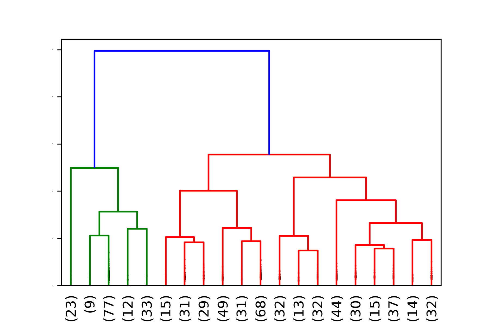

Daniel Zheng, [daniel.zheng@pitt.edu](mailto:daniel.zheng@pitt.edu)
# Automatic Bookmark Organizing with Document Clustering
### Table of Contents
- [Introduction](#introduction)
- [Data](#data)
  - [License](#license)
  - [Preprocessing](#preprocessing)
- [Clustering](#clustering)
  - [K-means](#k-means)
    - [Labeling](#k-means-labeling)
  - [Hierarchical](#hierarchical)
    - [Labeling](#hierarchical-labeling)
- [Discussion](#discussion)

## Introduction
This project began when I realized that my browser's bookmarks bar was a mess and desired a way to automatically clean it up. Whenever I come across an interesting webpage, I immediately bookmark it. However, over the years, I've stopped properly organizing these bookmarks and placing them into appropriate folders, instead leaving them just as links, not even contained in a single folder. At the far right of my bookmarks bar is a `>>` icon, which expands into a horrifyingly long list of hundreds of URLs when clicked. Undoubtedly, many, if not all of these links contain interesting and useful information, but they are so disorganized that it is essentially impossible for me to ever find what I'm looking for.

For my term project in LING1340, I initially thought it would be interesting to create a Chrome extension that takes list of bookmarks (URLs), automatically clusters them into folders, and rearranges the bookmarks bar, solving my problem.

This would entail:
- Learning Chrome's bookmarks API and making the extension
- Hierarchical clustering
- Cluster labeling (folder names)

Since the class is about natural language processing, I chose to focus on investigating clustering and labeling for this project.

## Data
I did not want to publicly share my own bookmarks list for privacy reasons, so I began by accumulating a list of news articles and other webpages through web scraping with `BeautifulSoup`, stripping HTML tags and removing JavaScript code to extract text that was representative of the contents of each page. Though this is closest to the initial bookmark organizing project I described, it was tedious and difficult to compile a large dataset by hand. As a simplification, I chose to use a Wikipedia dump. Because the clustering algorithms I'm investigating are completely unsupervised, it shouldn't matter what kind of data they are run on. I also chose Wikipedia because Wikipedia articles have very clear and focused topics, ideal for clustering algorithms.

### License
Wikipedia is licensed under CC-BY-SA according to [this page](https://en.wikipedia.org/wiki/Wikipedia:Reusing_Wikipedia_content), which requires me to distribute resulting work under a similar license. Accordingly, my repository is licensed under GPLv3.

### Preprocessing
The Wikipedia data was initially in an extremely unwieldy XML format. Luckily, I was able to find the [Wikiextractor](https://github.com/attardi/wikiextractor/) library that I used to convert my into a much more manageable JSON format, saving `title, url, text`, and `id` for each article. This saved each article on one line, so I performed some further processing myself to save all articles in a file into one list.

## Clustering
With my data in hand, I began to read about clustering. I quickly learned that there are two main types of clustering, K-means and Hierarchical. While hierarchical clustering seemed more suitable for my bookmark organizing problem, as it organizes things into clusters and sub-cluster, K-means was more intuitive and simpler to understand. For this reason, I chose to first look at K-means clustering.

### K-means
The K-means clustering algorithm aims to produce *k* clusters by finding *k* centroids and a label for each data point, so that each point belongs to the cluster with the nearest centroid, or mean.

First, initialize the centroids. There are a variety of ways to do this that can speed the algorithm up, but for simplicity let's assume random initialization.

The main algorithm consists of two repeated steps.
1. For each point, calculate the Euclidean distance in the feature space to each centroid, assigning it to the closest one.
2. Recalculate the centroids to be the averages of the points in each current cluster.
3. Repeat steps 1 and 2 until there are no longer any changes in the centroids.

Below is a graphic from [this page](http://www.learnbymarketing.com/methods/k-means-clustering/) that shows K-means in action.

I ran K-means on a small sample of articles with subjects beginning with the letter __A__. I first used [tf-idf](http://www.tfidf.com/) to produce vector representations of each article's text that would be representative of their content. Since tf-idf produces sparse vectors, they were converted to dense vectors using Truncated Singular Value Decomposition to speed up the K-means algorithm. After K-means was run, the resulting clusters were fed into [t-SNE](https://lvdmaaten.github.io/tsne/), an embedding algorithm that maps high-dimensional feature space data to 2D while grouping similar data closer together.

The following output was produced:

### K-means Labeling
While the clustering output is neat, and there are some noticeably distinct clusters, it's important to keep in mind that the original purpose was to place bookmarks into *properly labeled* folders. Generating cluster labels proved to be extremely challenging.

#### Topic Modeling
Initially, I attempted to use `gensim` to extract the top few topics within each article, then use these to find the top topics describing each cluster. This was very slow and also didn't work very well. Out of clusters of hundreds of articles, the top topics would occur maybe five to ten times. I realized that since K-means only does a single layer of clustering, it's likely that articles in the same cluster can be about very different topics. However, being in the same cluster indicates that they have *something* in common, even if isn't their main topics.

To find overlap between many (potentially disparate) documents, I devised a simpler method using `spacy`. The provided `noun_chunks` function was an excellent way to extract noun phrases from each document. After removing phrases that were considered stopwords, I took the top few most common phrases and used those as labels. For *k=10*, the following labels were generated. For a more in-depth look at the contents of the clusters, see my slides [here](ling1340_slides.pdf).

| Cluster | Computed Labels                                                     |
|---------|---------------------------------------------------------------------|
| 0       | example, water, acupuncture, autism, Audi                           |
| 1       | Alexander, Augustus, Rome, Abu Bakr, Agrippina                      |
| 2       | choice, the axiom, example, the United States, assault              |
| 3       | August, place, July, the year, the peak                             |
| 4       | Lincoln, Azerbaijan, Jackson, the country, Apple                    |
| 5       | April, the month, the Northern Hemisphere, spring, the fourth month |
| 6       | Apollo, England, Crowley, Aristotle, the time                       |
| 7       | the city, Amsterdam, Athens, Athena, Aarhus                         |
| 8       | example, Arabic, ASL, APL, the language                             |
| 9       | Amasis, Egypt, Herodotus, Cambyses, Apries                          |

I have so far been unable to come up with a method to generate a single label for each cluster that is a phrase representative of the contents of the cluster. This is partly because k-means is not the most effective algorithm for this problem.

## Hierarchical
The hierarchical method I investigated was aggolmerative clustering. While K-means requires a parameter *k* and initial centroids, agglomerative clustering just requires some distance metric.

I chose to use cosine similarity, a better metric than Euclidean distance because it finds the cosine of the angle between the text vectors, a good way to measure semantic distance. Euclidean distance is also more expensive to calculate in high dimensions.

The agglomerative clustering algorithm builds a binary tree. It works as follow:
1. Place each data point in its own group
2. Repeatedly merge two closest groups until everything is in a
single cluster

I ran the hierarchical clustering algorithm on the same sample of articles with subjects beginning with the letter __A__. I first used [tf-idf](http://www.tfidf.com/) to produce vector representations of each article's text that would be representative of their content. A distance matrix using cosine similarity was produced and passed to the clustering algorithm.
The SciPy dendrogram visualization was used to view results.

The following output was produced:

Trimming down the lower-level clusters:

I take a closer look at the clusters in slides 26-28 of [my presentation](ling1340_slides.pdf) and it is clear that this clustering algorithm produced a far more suitable result.
### Hierarchical Labeling
At the time of writing this report, I was unable to produce hierarchical labels. The SciPy linkage matrix API documentation did not provide much information on how to extract each cluster and I was unable to find any guidance online.

## Discussion
